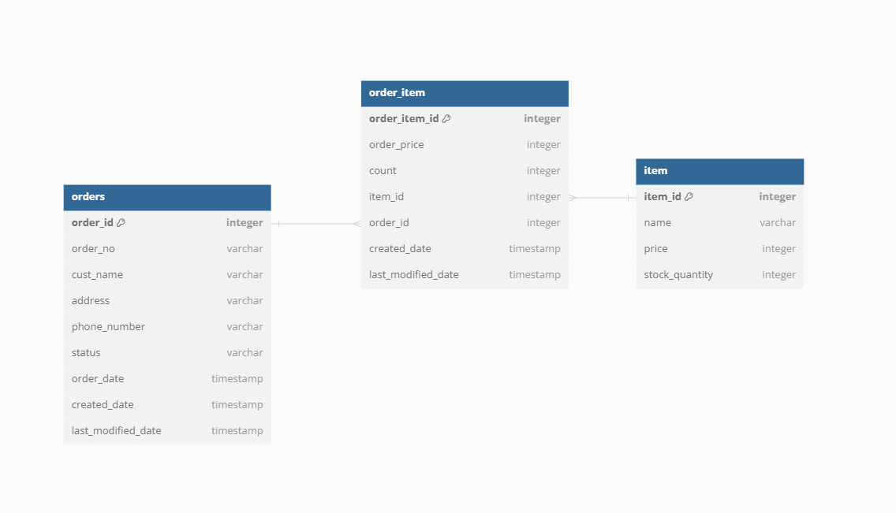

# toyProject

### 개발 스펙
- Gradle 7.4.1
- Spring Boot 2.6.2
- Spring Data JPA
- JAVA 11
- H2
- RESTful API
- QueryDSL
- Junit5

### 테이블 관계


### 테스트코드
- OrderServiceSaveTest
- OrderServiceCancelTest
- OrderServiceUpdateTest


### API
#### [POST] /orders/register
- 요청
```
{
    "orderBasicInfo": {
      "custName": "주윤재",
      "phoneNumber": "01099999999",
      "address": "파스토"
    },
    "orderItemInfos": [
      {
        "itemId": 1,
        "count": 3
      },
      {
        "itemId": 2,
        "count": 3
      }
    ]
}
```
- 응답
```
Order created successfully
```
---
#### [POST] /orders
- 요청
```
{
    "custName" : "주윤재",
    "startDate" : "2023-07-17"
}
```
- 응답
```
[
    {
        "orderid": 1,
        "orderNo": "2023-07-17#주윤재#00001",
        "custName": "주윤재",
        "phoneNumber": "01099999999",
        "address": "파스토",
        "orderStatus": "PREPARING",
        "orderDate": "2023-07-17T15:52:34.973362",
        "itemName": "코카콜라",
        "totalPrice": 3,
        "count": 3000
    },
    {
        "orderid": 1,
        "orderNo": "2023-07-17#주윤재#00001",
        "custName": "주윤재",
        "phoneNumber": "01099999999",
        "address": "파스토",
        "orderStatus": "PREPARING",
        "orderDate": "2023-07-17T15:52:34.973362",
        "itemName": "치킨",
        "totalPrice": 3,
        "count": 60000
    }
]
```
---
#### [PUT] /orders/1/cancel
- 응답
```
Order cancelled successfully
```
---
#### [PUT] /orders/1
- 요청
```
{
  "orderBasicInfo": {
    "address": "저스트코타워"
  }
}
```
- 응답
```
Order updated successfully
```